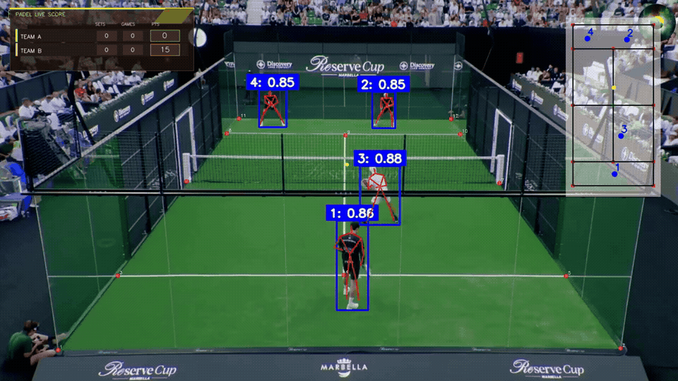

# Padel Score & Match Analytics

Player and ball tracking, court projection, and experimental point-event scoring from match video.

**[Watch the demo](assets/demo.mp4)** · **[Technical approach](docs/architecture.md)** · **[Evaluation](results/metrics.md)** · **[Media notes](docs/media.md)**

Recorded project output; the animation plays automatically. See evidence boundaries below.

## Overview

This project extends a padel video-analysis codebase with scoring workflows, audio/visual event candidates, and explicit scoreboard validation. Its interface brings player detections, pose overlays, court context, and a scoring display into the same annotated output.

**Stack:** Python · Ultralytics · OpenCV · FastAPI · Streamlit · pandas

## What it does

- Track players and the ball with configurable models and caches.
- Project detections onto a 2D court using calibrated keypoints.
- Generate point-event proposals and evaluate timing and winner attribution.
- Keep scoreboard-derived validation and label replay separate from independent gameplay prediction.
- Run analysis through a FastAPI job service or the included local interfaces.

## Results and evidence

| Historical experiment | Result | Denominator |
| :--- | ---: | :--- |
| Proposal precision | 55.56% | 5 matched / 9 proposals |
| Proposal recall | 62.50% | 5 matched / 8 labeled points |
| Winner attribution on matched events | 80.00% | 4 correct / 5 matched |
| Score timeline frame accuracy | 0.00% | 0 / 373 comparable frames |

Timing tolerance: 2 seconds. These are separate saved report views of one local recording, not a general benchmark. The failed score-timeline result is included deliberately. [Sanitized report values →](results/evaluation.json)

## Engineering approach

A legal score sequence can still be wrong if a point is missed or attributed to the wrong side. Candidate timing, winner attribution, and score accumulation therefore need separate checks.

The public code includes the local analytics/backend extensions as well as upstream tracking modules. The supplied recording demonstrates the composed interface, but its exact score-source configuration is not established. Configuration explicitly supports proposal, gameplay, and replay-related artifacts; these must not be conflated.

## Limitations

Automatic scoring remains experimental. Replay from supplied labels or scoreboard observations is not independent scoring accuracy. Fixed-camera calibration, occlusion, player-ID changes, and missed ball events can destabilize downstream statistics.

## Explore the project

See [the preserved setup reference](docs/upstream-readme.md) and [backend usage](docs/backend.md). Install `requirements.txt`, provide the model files referenced by `config.py`, and configure your own match video and court calibration. FFmpeg must also be available as a system executable. Model downloads and full datasets are not bundled.

## Repository scope

Selected project code, documentation, curated demonstration media, and available evaluation evidence are published here. Model weights, checkpoints, datasets, secrets, caches, and original Git history are excluded.

Derived from Joao-M-Silva/padel_analytics. The original README and CC BY-NC-SA 4.0 license are retained. This publication adds a case-study README, curated media, aggregate evaluation presentation, and includes the supplied local scoring/backend extensions. Individual authorship of every inherited module is not claimed.

Upstream: [Joao-M-Silva/padel_analytics](https://github.com/Joao-M-Silva/padel_analytics). See [LICENSE](LICENSE) and [THIRD_PARTY_NOTICES.md](THIRD_PARTY_NOTICES.md).

