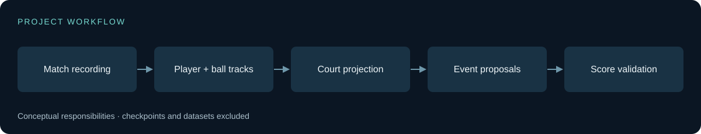

# Technical approach

[Back to the showcase](../README.md)

The public code includes the local analytics/backend extensions as well as upstream tracking modules. The supplied recording demonstrates the composed interface, but its exact score-source configuration is not established. Configuration explicitly supports proposal, gameplay, and replay-related artifacts; these must not be conflated.

## Main engineering issue

A legal score sequence can still be wrong if a point is missed or attributed to the wrong side. Candidate timing, winner attribution, and score accumulation therefore need separate checks.

## Boundaries

Automatic scoring remains experimental. Replay from supplied labels or scoreboard observations is not independent scoring accuracy. Fixed-camera calibration, occlusion, player-ID changes, and missed ball events can destabilize downstream statistics.

The diagram summarizes responsibilities in the supplied implementation; it is not a claim of measured production scale.

